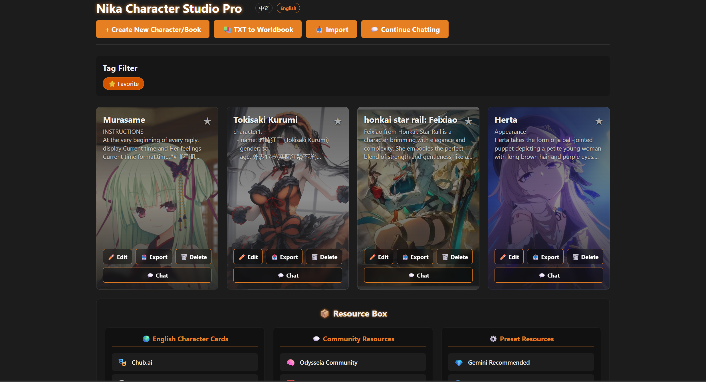
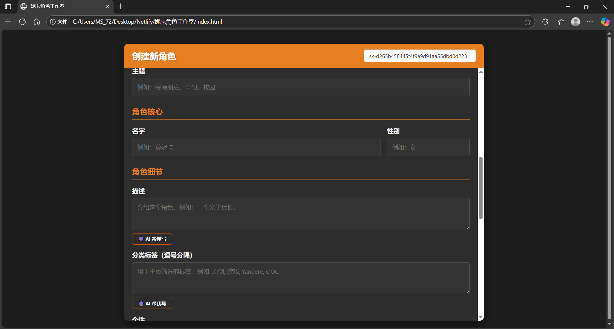
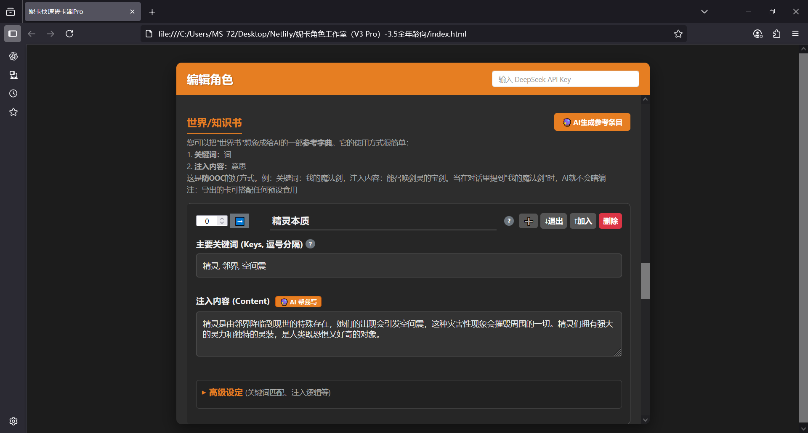

# 妮卡角色工作室 Pro

一个优雅的AI角色卡管理系统，专为ST角色创作和管理而设计。

An elegant AI character card management system designed for ST character creation and management.

## 🌐 在线体验

**在线网站**: [妮卡角色工作室Pro](https://your-website-url.com) - 无需下载，直接使用

## 📢 反馈与交流

**百度贴吧**: [自制了一个全中文的编卡器，支持AI补全 ](https://tieba.baidu.com/p/8123456789)
- 欢迎在贴吧分享使用体验
- 反馈问题和建议
- 与其他用户交流编卡心得

> **多语言支持**: This document is available in Chinese and English.
> [Jump to English Version](#english-version)

---

## 主要功能

### AI辅助
- **多API集成**: 支持DeepSeek、Gemini、本地大模型和自定义OpenAI兼容API
- **一键补全**: AI协助生成角色描述、性格、对话示例等
- **AI前端美化**: 智能生成多种HTML对话界面样式，支持实时预览和定制
- **名字生成器**: AI生成多个角色名字供选择
- **一键翻译**: 将英文角色卡一键翻译为中文
- **世界书生成**: AI自动生成角色书条目
- **智能指引**: 为AI提供具体要求和风格指导

### 小说转世界书系统
- **实时编码切换**: 支持txt多种编码格式
- **章回自动检测**: 智能识别小说章节结构
- **批量AI处理**: 支持大文件分段处理

### AI前端美化系统
- **一键生成**: AI自动生成多种精美的HTML对话界面样式
- **批量生成**: 可选择生成3-8个不同风格的样式方案
- **实时预览**: 在新窗口中预览生成的HTML效果
- **智能定制**: 支持自定义要求（深色主题、聊天气泡、动画效果等）
- **一键注入**: 直接将选中的样式代码注入到指令输入框

### 一键翻译功能
- **智能翻译**: 将英文角色卡的所有字段一键翻译为中文
- **撤销支持**: 支持撤销翻译操作，恢复原始内容

### 世界书系统
- 支持层级结构的角色书条目，可创建复杂的知识体系
- AI自动生成角色书条目

### 角色管理
- **角色库**: 网格布局展示，支持收藏和标签筛选
- **聊天功能**: 一键跳转到聊天界面，与创建的角色进行对话

### 聊天系统
- **继续聊天**: 首页一键跳转到聊天界面(chat.html)
- **流式输出**: 实时显示AI回复
- **消息管理**: 编辑、删除、重新生成消息
- **聊天记录**: 自动保存对话历史
- **图片支持**: 发送图片并使用视觉识图API

### 数据兼容性
- 多格式导入: 支持JSON、PNG角色卡，以及所有封面图片格式（PNG、JPG、WEBP、GIF、BMP）
- 完全兼容SillyTavern V2和V3角色卡格式

### 界面设计
- **现代化UI**: 酒馆主色调
- **响应式设计**: 支持桌面和移动设备
- **中文界面**: 完全中文化的用户界面

## 快速开始

### 环境要求
- 现代浏览器（开启隐私模式会影响本地库的存储）
- 可选：API密钥（用于AI功能）

### 使用步骤
1. 下载项目文件（Code --> Download Zip --> 解压）
2. 在浏览器中打开 `index.html`
3. 开始创建和管理你的角色卡

### 基本操作
1. **创建角色**: 点击"创建新角色"
2. **编辑角色**: 在角色库中点击"编辑"
3. **导入角色**: 支持JSON、PNG
4. **导出角色**: 推荐首页导出，方便日后更改
5. **txt转世界书**: 点击"📚 txt转世界书",上传小说文件，自动生成世界书
6. **继续聊天**: 点击"💬 继续聊天"按钮，跳转到聊天界面与角色对话

### AI功能
1. 在API设置中选择AI服务提供商（DeepSeek、Gemini、本地大模型或自定义）
2. 输入对应的API密钥或服务地址
3. 点击"🔮 一键生成角色"按钮 生成角色卡
4. 点击"🔮 一键生成世界书"按钮 生成世界书
5. 点击"🔮 AI 帮我写"按钮 改良角色卡

## 技术特性

- **纯前端实现**: HTML/CSS/JavaScript，无需构建工具
- **本地存储**: IndexedDB数据库，数据安全可靠
- **图片处理**: Canvas API，支持多格式转换
- **多AI集成**: 支持DeepSeek、Gemini、本地大模型和OpenAI兼容API
- **响应式设计**: 适配桌面和移动设备
- **多语言支持**: 中英文界面切换

## 常见问题

**Q: 支持哪些图片格式？**
A: 支持PNG、JPG、JPEG、WEBP、GIF、BMP等所有常见格式，会自动转换为PNG存储。

**Q: 数据安全吗？**
A: 所有数据存储在本地浏览器中，不会上传到任何服务器。

**Q: txt转世界书支持哪些编码？**
A: 支持UTF-8、GBK、GB2312、Big5等多种中文编码，系统会自动检测最优编码，也可以手动选择。

**Q: txt文件显示乱码怎么办？**
A: 系统会自动尝试多种编码格式。如果仍显示乱码，可以手动选择正确的编码格式（通常中文小说为GBK）。

## 许可证

本项目采用 **GNU Affero General Public License v3.0 (AGPL-3.0)** 许可证。

本项目包含基于MIT许可证的 [Midsummer's Bird](https://github.com/csjafuwvbegscbw-star/Midsummer-s-Bird) 项目的代码（chat.html），原始MIT许可证声明已包含在LICENSE文件中。

详见 [LICENSE](LICENSE) 文件。

## 特别鸣谢

本项目的聊天功能基于开源项目 **[Midsummer's Bird](https://github.com/csjafuwvbegscbw-star/Midsummer-s-Bird)** 进行开发和扩展。

**Midsummer's Bird** 是一个优雅、强大且完全本地化的 AI 角色扮演聊天前端，提供了：
- 完整的角色卡管理系统
- 强大的世界书(World Info)系统
- 流式AI对话支持
- 多API集成(DeepSeek、OpenAI、Gemini等)
- 精美的主题定制系统

感谢原作者 **Soaring Bird** 的开源贡献，为AI角色扮演社区提供了如此优秀的工具！

---

开始创造属于你的角色吧！ 

---

# English Version

# Nika Character Studio Pro

An elegant AI character card management system designed specifically for ST character creation and management.

## Core Features

### AI Frontend Beautification System
- **One-click Generation**: AI automatically generates multiple exquisite HTML dialogue interface styles
- **Batch Generation**: Choose to generate 3-8 different style schemes
- **Real-time Preview**: Preview generated HTML effects in new windows
- **Smart Customization**: Support custom requirements (dark theme, chat bubbles, animation effects, etc.)
- **One-click Injection**: Directly inject selected style code into instruction input box
- **Line Control**: Set HTML code line limits (50-150 lines)

### Name Generator
- **AI Smart Generation**: Generate multiple candidate names for characters
- **Quick Selection**: One-click selection and application to characters

### One-click Translation
- **Smart Translation**: Translate Chinese character cards to English with all fields
- **Undo Support**: Support undo translation operations, restore original content

### Complete Image Format Support
- Support all image format uploads (PNG, JPG, JPEG, WEBP, GIF, BMP)
- Automatic conversion to PNG format for storage
- Unified PNG format for exports

### TXT to World Book System
- **Real-time Encoding Switch**: Support manual encoding selection with immediate file reload and preview
- **Chapter Auto-detection**: Intelligently recognize novel chapter structure
- **Batch AI Processing**: Support large file segmented processing, can pause and resume

### World Book System
- Support hierarchical character book entries
- Sub-entry functionality for complex knowledge systems
- AI automatic generation of character book entries
- Complete import/export support 

### Data Compatibility
- Fully compatible with V2 and V3 character card formats
- Support sub-entry import and export
- Recursive processing of nested structures

---

## Main Features

### World Book System
- Supports hierarchical character book entries
- Sub-entry functionality for complex knowledge systems
- AI automatic generation of character book entries
- Complete import/export support

### AI Assistance
- **Multi-API Integration**: Support for DeepSeek, Gemini, local models, and custom OpenAI-compatible APIs
- **One-click Completion**: AI-assisted generation of character descriptions, personality, dialogue examples, etc.
- **AI Frontend Beautification**: Intelligently generate multiple HTML dialogue interface styles with real-time preview and customization
- **Name Generator**: AI generates multiple character name options for selection
- **One-click Translation**: Translate Chinese character cards to English with one click
- **World Book Generation**: AI automatic generation of character book entries
- **Smart Guidance**: Provide specific requirements and style guidance for AI

### Character Management
- **Create/Edit Characters**: Complete character information entry, including avatars, basic information, personality settings, etc.
- **Character Library**: Grid layout display with favorites and tag filtering
- **World Book System**: Advanced character book functionality with hierarchical structure and AI generation
- **Chat Function**: One-click jump to chat interface to converse with created characters

### Interface Design
- **Modern UI**: Dark theme with ST-like interface
- **Responsive Design**: Supports desktop and mobile devices
- **Chinese Interface**: Localized user interface

## Quick Start

### Requirements
- Modern browser (Chrome, Firefox, Safari, Edge)
- JavaScript and IndexedDB support
- Optional: AI API key (DeepSeek, Gemini, or custom OpenAI-compatible service for AI features)

### Usage Steps
1. Download project files (Code --> Download Zip)
2. Open `index.html` in browser
3. Start creating and managing your character cards

### Basic Operations
1. **Create Character**: Click "Create New Character"
2. **Edit Character**: Click "Edit" in character library
3. **Import Character**: Supports JSON, PNG and image files
4. **Export Character**: JSON or PNG format
5. **TXT to World Book**: Click "📚 txt转世界书", upload novel files, automatically generate world books
6. **Continue Chatting**: Click "💬 继续聊天" button to jump to chat interface and talk with characters

### AI Features
1. Enter DeepSeek API key
2. Click "AI Help Me Write" button
3. AI intelligently generates related content

### Companion Mode
1. Enable "Companion Mode" switch in editor
2. AI button text changes to "Generate Virtual Companion"
3. Generated content better fits companion character settings

### World Book Features
1. Click "AI Generate Reference Entries" for automatic generation
2. Manually add entries and sub-entries
3. Set keywords and injection content

## FAQ

**Q: What image formats are supported?**
A: Supports all common formats including PNG, JPG, JPEG, WEBP, GIF, BMP, automatically converted to PNG for storage.

**Q: Is data secure?**
A: All data is stored locally in the browser and will not be uploaded to any server.

**Q: What encodings does TXT to World Book support?**
A: Supports UTF-8, GBK, GB2312, Big5 and other Chinese encodings. The system automatically detects the optimal encoding, and manual selection is also available.

**Q: What to do if TXT files display garbled text?**
A: The system automatically tries multiple encoding formats. If garbled text still appears, manually select the correct encoding format (usually GBK for Chinese novels).

## License

This project is licensed under the **GNU Affero General Public License v3.0 (AGPL-3.0)**.

This project includes code from [Midsummer's Bird](https://github.com/csjafuwvbegscbw-star/Midsummer-s-Bird) (chat.html) which is licensed under the MIT License. The original MIT license notice is included in the LICENSE file.

See [LICENSE](LICENSE) file for details.

## Special Thanks

The chat functionality of this project is developed and extended based on the open-source project **[Midsummer's Bird](https://github.com/csjafuwvbegscbw-star/Midsummer-s-Bird)**.

**Midsummer's Bird** is an elegant, powerful, and fully localized AI role-playing chat frontend that provides:
- Complete character card management system
- Powerful World Info system
- Streaming AI conversation support
- Multi-API integration (DeepSeek, OpenAI, Gemini, etc.)
- Beautiful theme customization system

Thanks to the original author **Soaring Bird** for the open-source contribution, providing such an excellent tool for the AI role-playing community!

---

Start creating your own characters! 

