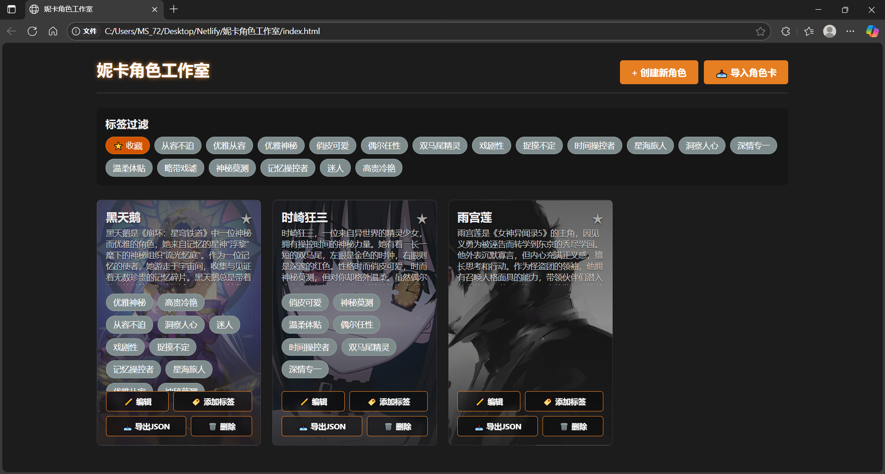

# 妮卡角色工作室 Pro

一个优雅的AI角色卡管理系统，专为ST角色创作和管理而设计。

An elegant AI character card management system designed for ST character creation and management.

> **多语言支持**: This document is available in Chinese and English.
> [Jump to English Version](#english-version)

---

## 主要功能

### 角色管理
- **创建/编辑角色**: 完整的角色信息录入，包括头像、基本信息、性格设定等
- **角色库**: 网格布局展示，支持收藏和标签筛选
- **世界书系统**: 高级角色书功能，支持层级结构和AI生成

### 导入导出
- **多格式导入**: 支持JSON、PNG角色卡，以及所有图片格式（PNG、JPG、WEBP、GIF、BMP）
- **自动转换**: 所有图片自动转换为PNG格式存储
- **JSON/PNG导出**: 导出角色卡为JSON或PNG格式

### AI辅助
- **DeepSeek集成**: 智能内容生成
- **一键补全**: AI协助生成角色描述、性格、对话示例等
- **伴侣模式**: 专门为虚拟伴侣角色设计的AI补全功能
- **世界书生成**: AI自动生成角色书条目

### 界面设计
- **现代化UI**: 深色主题，界面优雅美观
- **响应式设计**: 支持桌面和移动设备
- **中文界面**: 完全中文化的用户界面

## 快速开始

### 环境要求
- 现代浏览器（开启隐私模式会影响本地库的存储）
- 可选：DeepSeek API密钥（用于AI功能）

### 使用步骤
1. 下载项目文件
2. 在浏览器中打开 `index.html`
3. 开始创建和管理你的角色卡

## V3 Pro 新特性

### 图片格式支持
- 支持所有图片格式上传（PNG、JPG、JPEG、WEBP、GIF、BMP）
- 自动转换为PNG格式存储
- 导出时统一使用PNG格式

### 世界书系统
- 支持层级结构的角色书条目
- 子条目功能，可创建复杂的知识体系
- AI自动生成角色书条目
- 完整的导入/导出支持

### 伴侣模式
- 专门的虚拟伴侣角色AI补全功能
- 一键切换伴侣模式，AI生成更符合伴侣角色的内容
- 智能调整生成策略，让角色更贴近伴侣设定

### 加入后期指令词条
- 可以为输出自定义格式，如括号里面描写动作，外面发言

### 数据兼容性
- 完全兼容V2和V3角色卡格式
- 支持子条目的导入和导出
- 递归处理嵌套结构

## 技术特性

- **纯前端实现**: HTML/CSS/JavaScript，无需构建工具
- **本地存储**: IndexedDB数据库，数据安全可靠
- **图片处理**: Canvas API，支持多格式转换
- **AI集成**: DeepSeek API，智能内容生成

## 使用指南

### 基本操作
1. **创建角色**: 点击"创建新角色"
2. **编辑角色**: 在角色库中点击"编辑"
3. **导入角色**: 支持JSON、PNG和图片文件
4. **导出角色**: JSON或PNG格式

### AI功能
1. 输入DeepSeek API密钥
2. 点击"AI 帮我写"按钮
3. AI智能生成相关内容

### 伴侣模式
1. 在编辑器中开启"伴侣模式"开关
2. AI按钮文本会变为"生成虚拟伴侣"
3. 生成的内容会更符合伴侣角色设定

### 世界书功能
1. 点击"AI生成参考条目"自动生成
2. 手动添加条目和子条目
3. 设置关键词和注入内容

## 常见问题

**Q: 支持哪些图片格式？**
A: 支持PNG、JPG、JPEG、WEBP、GIF、BMP等所有常见格式，会自动转换为PNG存储。

**Q: 这个版本世界书子条目会丢失吗？**
A: 不会，V3 Pro版本完全支持子条目的导入、导出和显示。

**Q: 数据安全吗？**
A: 所有数据存储在本地浏览器中，不会上传到任何服务器。

**Q: 伴侣模式是什么？**
A: 伴侣模式是专门为虚拟伴侣角色设计的AI补全功能，开启后AI会生成更符合伴侣设定的内容，让角色更贴近伴侣关系。

## 许可证

本项目仅供个人学习和非商业用途使用。

### 版权声明
本项目采用自定义许可证，保留所有权利。未经明确授权，不得用于商业目的。

---

开始创造属于你的角色吧！ 

---

# English Version

# Nika Character Studio Pro

An elegant AI character card management system designed specifically for ST character creation and management.

## Main Features

### Character Management
- **Create/Edit Characters**: Complete character information entry, including avatars, basic information, personality settings, etc.
- **Character Library**: Grid layout display with favorites and tag filtering
- **World Book System**: Advanced character book functionality with hierarchical structure and AI generation

### Import/Export
- **Multi-format Import**: Supports JSON, PNG character cards, and all image formats (PNG, JPG, WEBP, GIF, BMP)
- **Auto Conversion**: All images automatically converted to PNG format for storage
- **JSON/PNG Export**: Export character cards in JSON or PNG format

### AI Assistance
- **DeepSeek Integration**: Intelligent content generation
- **One-click Completion**: AI-assisted generation of character descriptions, personality, dialogue examples, etc.
- **Companion Mode**: AI completion function specifically designed for virtual companion characters
- **World Book Generation**: AI automatic generation of character book entries

### Interface Design
- **Modern UI**: Dark theme with elegant and beautiful interface
- **Responsive Design**: Supports desktop and mobile devices
- **Chinese Interface**: Fully localized Chinese user interface

## Quick Start

### Requirements
- Modern browser (Chrome, Firefox, Safari, Edge)
- JavaScript and IndexedDB support
- Optional: DeepSeek API key (for AI features)

### Usage Steps
1. Download project files
2. Open `index.html` in browser
3. Start creating and managing your character cards

## V3 Pro New Features

### Image Format Support
- Supports all image format uploads (PNG, JPG, JPEG, WEBP, GIF, BMP)
- Automatic conversion to PNG format for storage
- Unified PNG format for exports

### World Book System
- Supports hierarchical character book entries
- Sub-entry functionality for complex knowledge systems
- AI automatic generation of character book entries
- Complete import/export support

### Companion Mode
- Specialized AI completion for virtual companion characters
- One-click switch to companion mode with AI-generated content more suitable for companion characters
- Intelligent generation strategy adjustment for more companion-like character settings

### Add post instruction entries
- You can customize the output format, such as describing actions in brackets and speaking outside

### Data Compatibility
- Fully compatible with V2 and V3 character card formats
- Supports sub-entry import and export
- Recursive processing of nested structures

## Technical Features

- **Pure Frontend Implementation**: HTML/CSS/JavaScript, no build tools required
- **Local Storage**: IndexedDB database for secure and reliable data storage
- **Image Processing**: Canvas API with multi-format conversion support
- **AI Integration**: DeepSeek API for intelligent content generation

## User Guide

### Basic Operations
1. **Create Character**: Click "Create New Character"
2. **Edit Character**: Click "Edit" in character library
3. **Import Character**: Supports JSON, PNG and image files
4. **Export Character**: JSON or PNG format

### AI Features
1. Enter DeepSeek API key
2. Click "AI Help Me Write" button
3. AI intelligently generates related content

### Companion Mode
1. Enable "Companion Mode" switch in editor
2. AI button text changes to "Generate Virtual Companion"
3. Generated content better fits companion character settings

### World Book Features
1. Click "AI Generate Reference Entries" for automatic generation
2. Manually add entries and sub-entries
3. Set keywords and injection content

## FAQ

**Q: What image formats are supported?**
A: Supports all common formats including PNG, JPG, JPEG, WEBP, GIF, BMP, automatically converted to PNG for storage.

**Q: Will world book sub-entries be lost in this version?**
A: No, V3 Pro version fully supports sub-entry import, export and display.

**Q: Is data secure?**
A: All data is stored locally in the browser and will not be uploaded to any server.

**Q: What is Companion Mode?**
A: Companion Mode is an AI completion function specifically designed for virtual companion characters. When enabled, AI generates content more suitable for companion settings, making characters more aligned with companion relationships.

## License

This project is for personal learning and non-commercial use only.

### Copyright Notice
This project uses a custom license with all rights reserved. Commercial use is not permitted without explicit authorization.

---

Start creating your own characters! 
